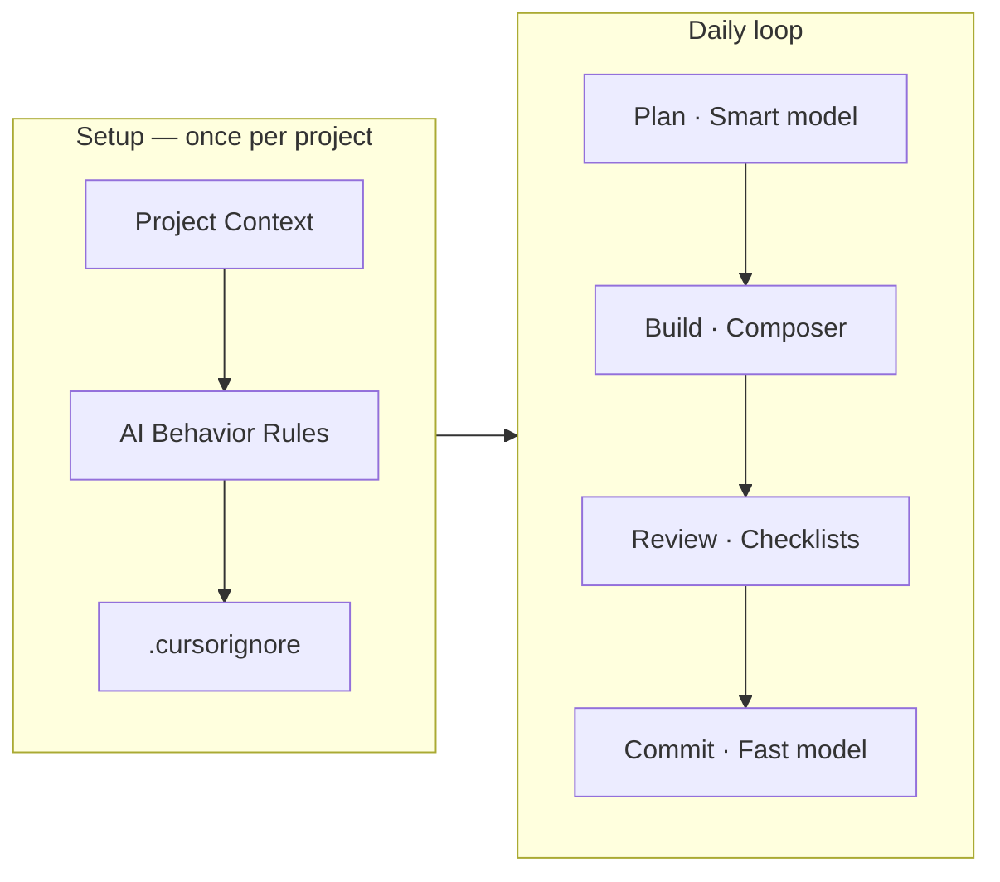
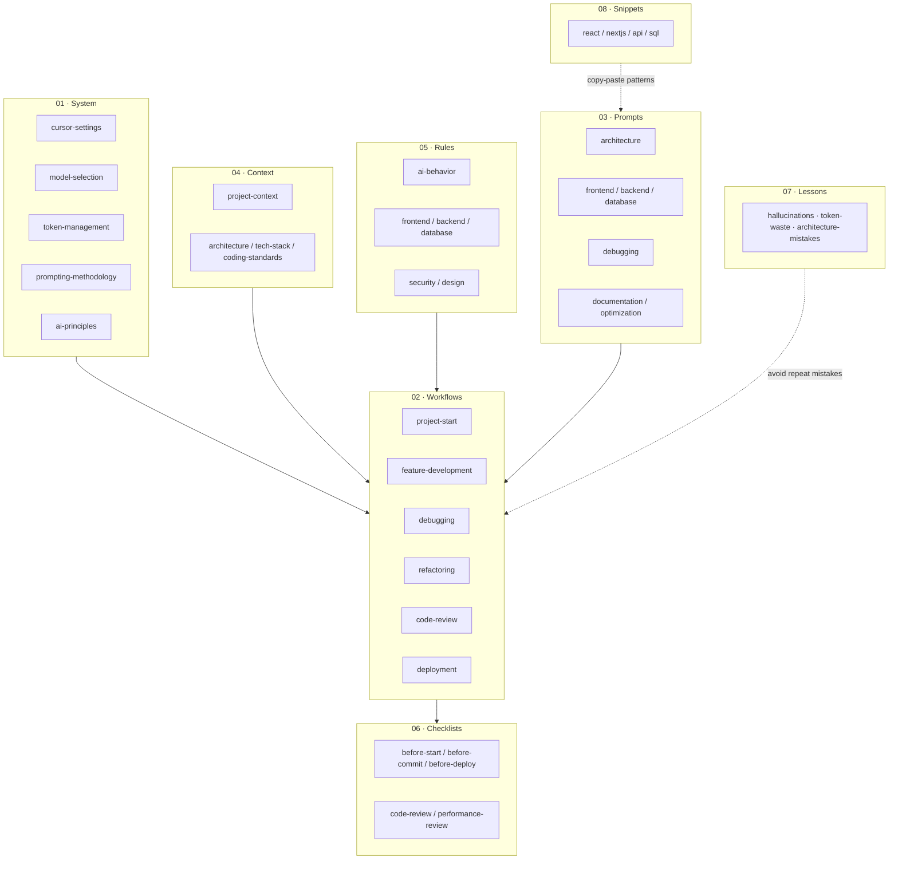
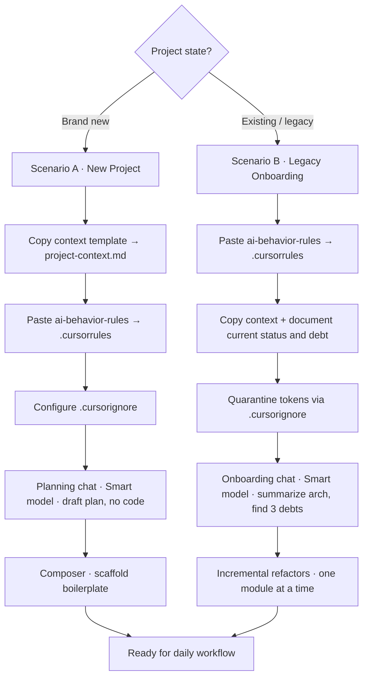
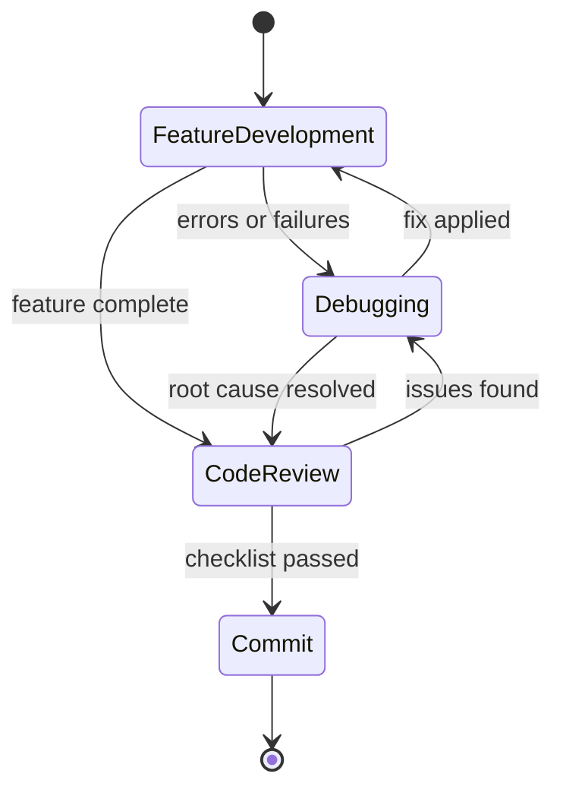
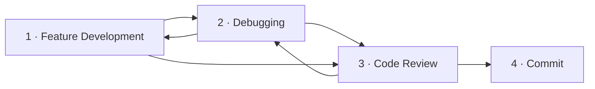
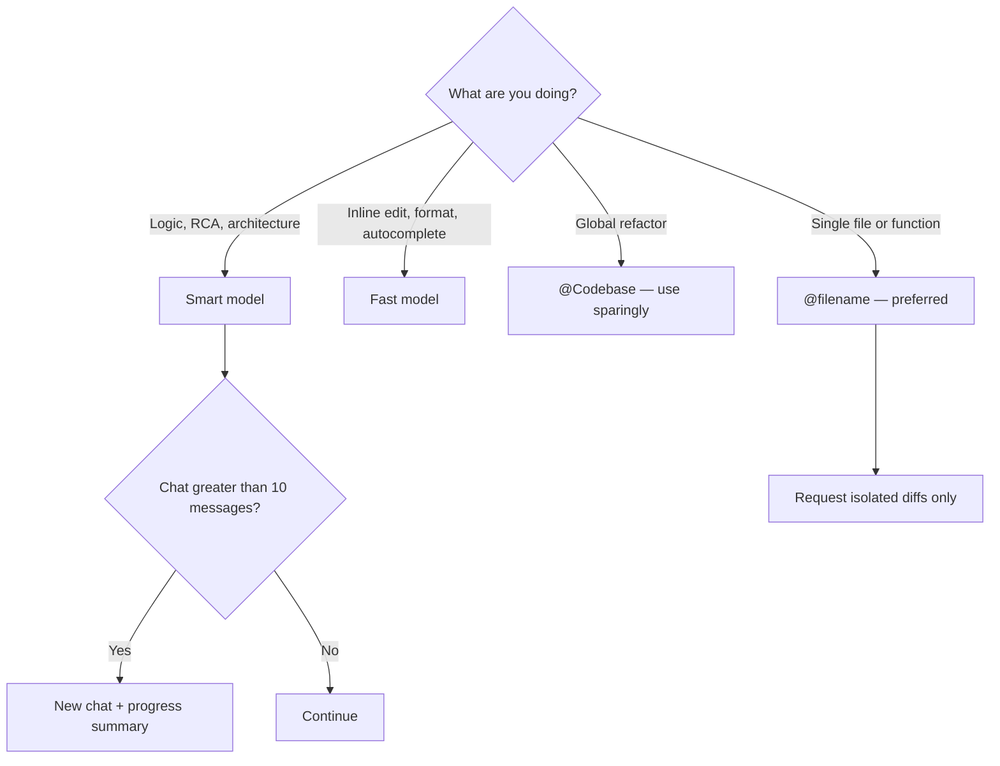

# Cursor AI Engineering Playbook

> **Central operating system** for AI-assisted full-stack development — strict rules, structured workflows, and production-grade prompts to maximize Cursor efficiency, reduce token use, and enforce enterprise-grade standards.

---

## Table of Contents

| Section | Description |
| :------ | :---------- |
| [At a Glance](#at-a-glance) | One-page overview and entry points |
| [Daily Quick Access](#-daily-quick-access) | Pin these files in every session |
| [How the Playbook Fits Together](#how-the-playbook-fits-together) | Directory map and dependencies |
| [Project Initialization](#-project-initialization-new-vs-existing) | New vs. legacy onboarding paths |
| [Daily Operating Workflow](#-daily-operating-workflow) | Feature → Debug → Review → Commit |
| [**Token Optimization**](#-maximum-quality-minimum-cost) | **Critical — cost and quality controls** |
| [Complete System Index](#-complete-system-index) | Full file reference |

---

## At a Glance

| Goal | Where to start |
| :---- | :------------- |
| New chat on any task | [`project-context-template.md`](./04-context/project-context-template.md) |
| Constrain AI output | [`ai-behavior-rules.md`](./05-rules/ai-behavior-rules.md) |
| **Save tokens** | [**`token-management.md`**](./01-system/token-management.md) |
| Fix a bug | [`debugging-prompts.md`](./03-prompts/debugging-prompts.md) |
| Pick the right model | [`model-selection.md`](./01-system/model-selection.md) |

---

## 📌 Daily Quick Access

Pin these in Cursor — reference them with `@filename` instead of re-explaining context every chat.

| Resource | Purpose | Path |
| :------- | :------ | :--- |
| **Project Context** | Always reference first in new chats | [`project-context-template.md`](./04-context/project-context-template.md) |
| **AI Behavior Rules** | Core constraints for code generation | [`ai-behavior-rules.md`](./05-rules/ai-behavior-rules.md) |
| **Token Management** | Strategies to avoid context bloat | [`token-management.md`](./01-system/token-management.md) |
| **Debugging Prompts** | Copy/paste templates for stack traces | [`debugging-prompts.md`](./03-prompts/debugging-prompts.md) |
| **Model Selection** | When to use Fast vs. Smart models | [`model-selection.md`](./01-system/model-selection.md) |

---

## How the Playbook Fits Together

Eight numbered directories form a layered system: **configure → contextualize → constrain → execute → verify → learn**.

---

## 🚀 Project Initialization: New vs. Existing

Before writing code, the AI must understand the environment. Select the path that matches your project state.

### Decision Flow

### Scenario A: Starting a Brand New Project

| Step | Action |
| :--- | :----- |
| 1 | **Context and rules** — Copy [`project-context-template.md`](./04-context/project-context-template.md) to the project root as `project-context.md`. Paste [`ai-behavior-rules.md`](./05-rules/ai-behavior-rules.md) into `.cursorrules`. |
| 2 | **Protection** — Set up [`.cursorignore`](./01-system/token-management.md) immediately. |
| 3 | **Planning chat** — Smart model, no code yet: |
| 4 | **Scaffolding** — After approval, use Composer for boilerplate. |

**Planning prompt:**

> *"Read `@project-context.md`. Draft a file-tree structure and implementation plan. Do not write code yet."*

→ Full walkthrough: [`project-start-workflow.md`](./02-workflows/project-start-workflow.md)

### Scenario B: Onboarding a Legacy / Existing Project

Applying strict rules to existing code requires a phased approach to avoid fighting technical debt.

| Step | Action |
| :--- | :----- |
| 1 | **Rules injection** — Create `.cursorrules` from [`ai-behavior-rules.md`](./05-rules/ai-behavior-rules.md). |
| 2 | **Reality-based context** — Copy the context template and clearly state **Current Status** (e.g., *"Legacy codebase with technical debt. Goal: phased refactoring."*). |
| 3 | **Token quarantine** — Block build folders, virtual envs, and large media in `.cursorignore`. |
| 4 | **Onboarding chat** — Smart model (see prompt below). |
| 5 | **Incremental application** — Never ask to *"refactor the whole project"*. Use [`refactoring-workflow.md`](./02-workflows/refactoring-workflow.md) one file or module at a time. |

**Onboarding prompt:**

> *"I am introducing you to an existing codebase. Read `@project-context.md`. Review the core files in the main directory. **Task:** Summarize the architecture and identify 3 major technical debts or rule violations based on our `.cursorrules`. **Constraint:** Do not write any new code or attempt to fix them yet."*

---

## ⚙️ Daily Operating Workflow

The standard delivery cycle runs **Feature Development → Debugging → Code Review → Commit**. Debugging may loop back until the feature is stable; every commit passes the pre-commit checklist.

### Workflow Overview

### 1. Feature Development

| Step | Tool | Notes |
| :--- | :--- | :---- |
| Planning and architecture | **Chat · Smart model** (e.g. Claude Sonnet) | Decisions before code |
| Multi-file scaffolding | **Composer · Smart model** | Stick to the agreed plan |
| Domain constraints | `@frontend-rules.md` or `@backend-rules.md` | Enforce layer boundaries |

→ See also: [`feature-development.md`](./02-workflows/feature-development.md)

### 2. Debugging

| Rule | Detail |
| :--- | :----- |
| Context required | Never paste a raw error without context |
| Stack traces | Truncate; use templates from [`debugging-prompts.md`](./03-prompts/debugging-prompts.md) |
| Root cause first | Require **root cause** before the fix — prevents architectural regression |

→ Full process: [`debugging-workflow.md`](./02-workflows/debugging-workflow.md)

### 3. Code Review

| Step | Detail |
| :--- | :----- |
| Pre-commit gate | Run [`before-commit.md`](./06-checklists/before-commit.md) before every commit |
| Diff review | Highlight the diff; verify scope and rule compliance |
| PR reviews | Follow [`code-review-workflow.md`](./02-workflows/code-review-workflow.md) |

### 4. Commit

| Step | Detail |
| :--- | :----- |
| Message generation | Use a **Fast model** for conventional commit messages |
| Scope | One logical change per commit; reference the reviewed diff |

---

## 💰 Maximum Quality, Minimum Cost

> **Critical section.** Token discipline directly affects output quality, latency, and cost. Apply these rules on every task — not only when context feels large.

### Token Rules

| Rule | Do this | Avoid this |
| :--- | :------ | :--------- |
| **Precision mentions** | `@auth-service.py` | *"Look at the auth service"* |
| **Scope control** | `@Codebase` only for global refactors | Defaulting to full-repo context |
| **Model tiering** | Smart for logic and RCA; Fast for CMD+K and formatting | Smart model for trivial edits |
| **Chat hygiene** | New chat + summary after ~10 messages | Long threads that forget constraints |
| **Output isolation** | *"Output only `validate_token`, not the full file"* | Full file rewrites for small changes |

→ Deep dive: [`token-management.md`](./01-system/token-management.md) · [`optimization-prompts.md`](./03-prompts/optimization-prompts.md)

---

## 📂 Complete System Index

### 01 · System Configuration

| File | Description |
| :--- | :------------ |
| [`cursor-settings.md`](./01-system/cursor-settings.md) | Optimal IDE and AI settings |
| [`model-selection.md`](./01-system/model-selection.md) | Strategy for choosing LLMs |
| [`token-management.md`](./01-system/token-management.md) | Techniques to save tokens |
| [`prompting-methodology.md`](./01-system/prompting-methodology.md) | The CTCF prompting framework |
| [`ai-principles.md`](./01-system/ai-principles.md) | Foundational principles for AI-assisted work |

### 02 · Workflows

| File | Description |
| :--- | :------------ |
| [`project-start-workflow.md`](./02-workflows/project-start-workflow.md) | Scaffolding new applications safely |
| [`feature-development.md`](./02-workflows/feature-development.md) | End-to-end feature delivery |
| [`debugging-workflow.md`](./02-workflows/debugging-workflow.md) | Systematic error resolution |
| [`refactoring-workflow.md`](./02-workflows/refactoring-workflow.md) | Safely updating legacy code |
| [`code-review-workflow.md`](./02-workflows/code-review-workflow.md) | AI-assisted PR reviews |
| [`deployment-workflow.md`](./02-workflows/deployment-workflow.md) | Pre-deploy and release steps |

### 03 · Prompt Libraries

| File | Description |
| :--- | :------------ |
| [`architecture-prompts.md`](./03-prompts/architecture-prompts.md) | System design and planning |
| [`frontend-prompts.md`](./03-prompts/frontend-prompts.md) | React / Next.js components and UI |
| [`backend-prompts.md`](./03-prompts/backend-prompts.md) | FastAPI, endpoints, and services |
| [`database-prompts.md`](./03-prompts/database-prompts.md) | Schema design and optimizations |
| [`debugging-prompts.md`](./03-prompts/debugging-prompts.md) | RCA and bug-fixing templates |
| [`documentation-prompts.md`](./03-prompts/documentation-prompts.md) | Docs and README generation |
| [`optimization-prompts.md`](./03-prompts/optimization-prompts.md) | Performance and token optimization |

### 04 · Context Templates

| File | Description |
| :--- | :------------ |
| [`project-context-template.md`](./04-context/project-context-template.md) | Universal baseline for all projects |
| [`architecture-template.md`](./04-context/architecture-template.md) | System architecture snapshot |
| [`tech-stack-template.md`](./04-context/tech-stack-template.md) | Languages, frameworks, and infra |
| [`coding-standards-template.md`](./04-context/coding-standards-template.md) | Style and convention reference |

### 05 · Rules & Boundaries

| File | Description |
| :--- | :------------ |
| [`ai-behavior-rules.md`](./05-rules/ai-behavior-rules.md) | Core AI operational directives |
| [`frontend-rules.md`](./05-rules/frontend-rules.md) | UI, state management, and aesthetics |
| [`backend-rules.md`](./05-rules/backend-rules.md) | Layered architecture and API strictness |
| [`database-rules.md`](./05-rules/database-rules.md) | Normalization, constraints, safe migrations |
| [`security-rules.md`](./05-rules/security-rules.md) | Hardening, RBAC, vulnerability prevention |
| [`design-rules.md`](./05-rules/design-rules.md) | Visual and UX consistency |

### 06 · Quality Checklists

| File | Description |
| :--- | :------------ |
| [`before-start.md`](./06-checklists/before-start.md) | Pre-task verification |
| [`before-commit.md`](./06-checklists/before-commit.md) | Pre-commit verification |
| [`before-deploy.md`](./06-checklists/before-deploy.md) | Pre-production safety checks |
| [`code-review.md`](./06-checklists/code-review.md) | Review checklist for PRs |
| [`performance-review.md`](./06-checklists/performance-review.md) | Performance audit checklist |

### 07 · Lessons Learned

| File | Description |
| :--- | :------------ |
| [`hallucinations.md`](./07-lessons/hallucinations.md) | Patterns that cause AI hallucinations |
| [`token-waste-cases.md`](./07-lessons/token-waste-cases.md) | Real examples of wasted context |
| [`architecture-mistakes.md`](./07-lessons/architecture-mistakes.md) | Common structural anti-patterns |
| [`performance-lessons.md`](./07-lessons/performance-lessons.md) | Optimization takeaways |

### 08 · Code Snippets

| File | Description |
| :--- | :------------ |
| [`react-snippets.md`](./08-snippets/react-snippets.md) | Reusable React patterns |
| [`nextjs-snippets.md`](./08-snippets/nextjs-snippets.md) | Next.js app router patterns |
| [`api-snippets.md`](./08-snippets/api-snippets.md) | API endpoint templates |
| [`sql-snippets.md`](./08-snippets/sql-snippets.md) | Query and migration snippets |

---

*Maintained for highly efficient, token-optimized AI-assisted software engineering.*
